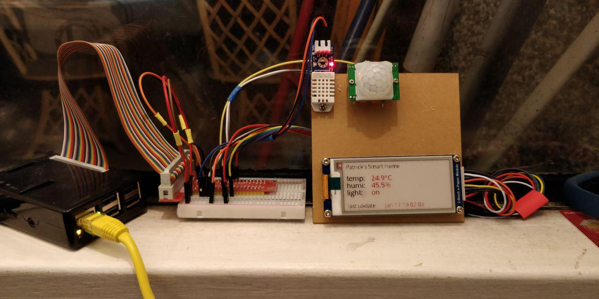
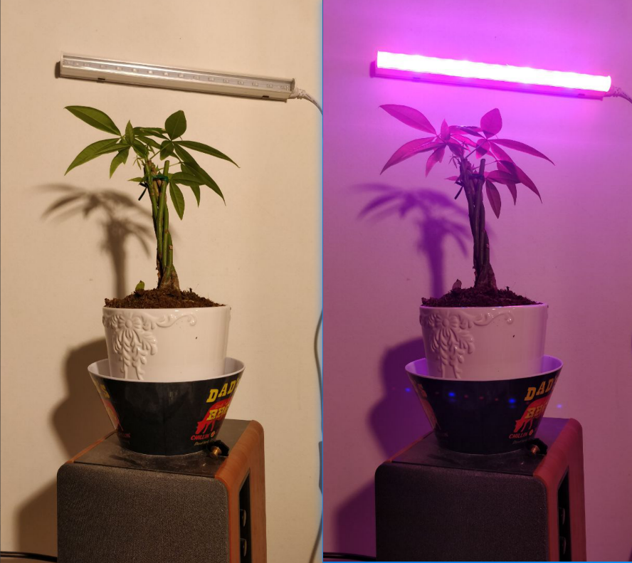

# Patrick's Smart Home

## How's my home?

## Components
1. e-paper module, waveshare e-paper, from taobao.
2. PIR motion sensor, used to turn on/off the light when I'm home.
3. Adafruit AM 2302 humidity and temperture sensor.
4. Raspberry pi 3, controlling all of them.
5. Acrylic board & M3 screws to support the sensors.
6. Smart phone with Telegram Bot to manually control the light.
7. Smart Wifi Plug with IFTTT.
8. Patrick lying on the bed.
